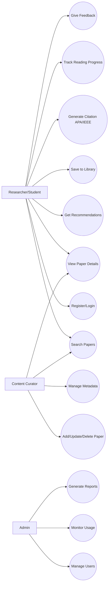
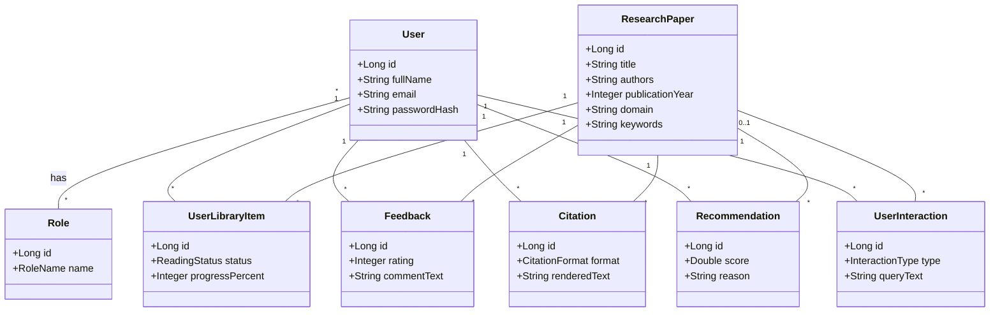
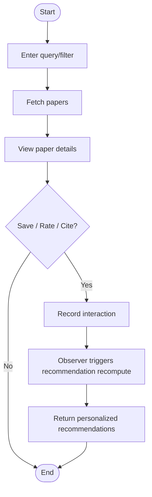
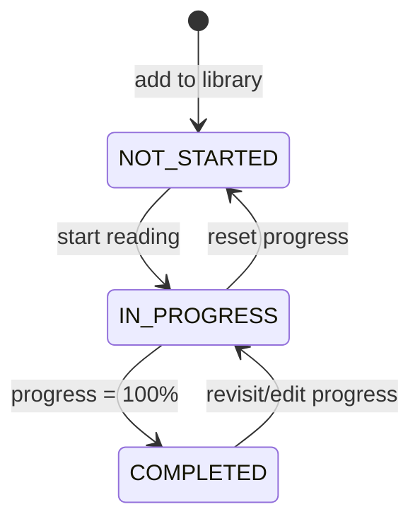

# UML Diagram Artifacts

Use these Mermaid diagrams directly in your report/slides (or convert to UML tools).

## 1) Use Case Diagram (roles + interactions)

## 2) Class Diagram (core domain)

## 3) Activity Diagram (search to recommendation flow)

## 4) State Diagram (library item lifecycle)

## 5) Pattern mapping
- Factory: `CitationFormatterFactory`
- Strategy: `RecommendationStrategy` + `ContentBasedRecommendationStrategy`
- Observer: `UserInteractionRecordedEvent` + `RecommendationUpdateListener`
- Proxy: `CachingRecommendationServiceProxy`
- Adapter: `ExternalMetadataAdapter` + `CrossrefMetadataAdapter`
